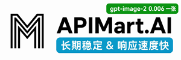
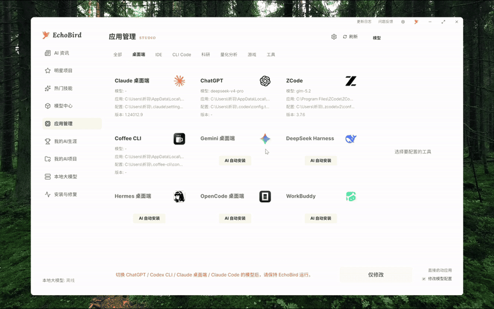
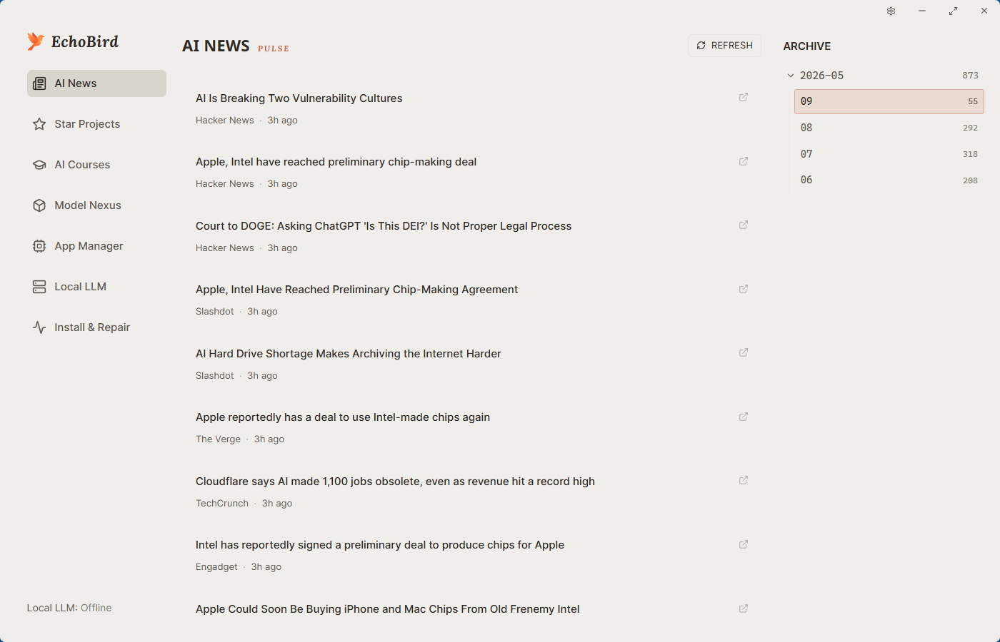
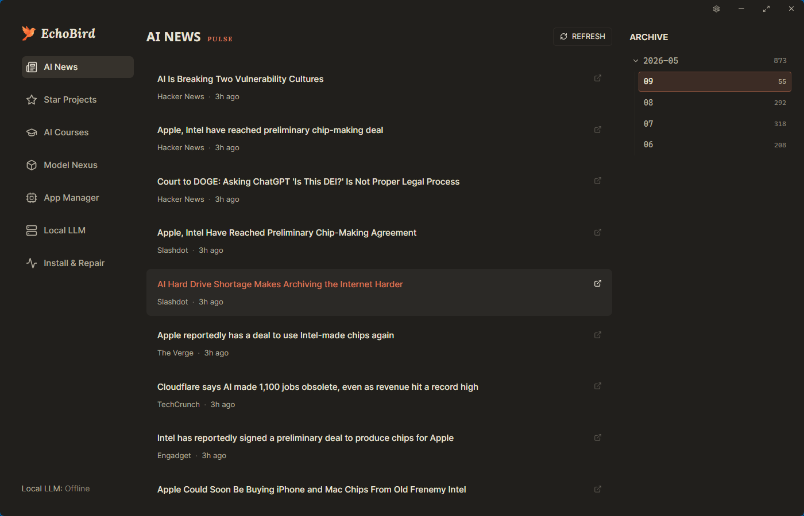
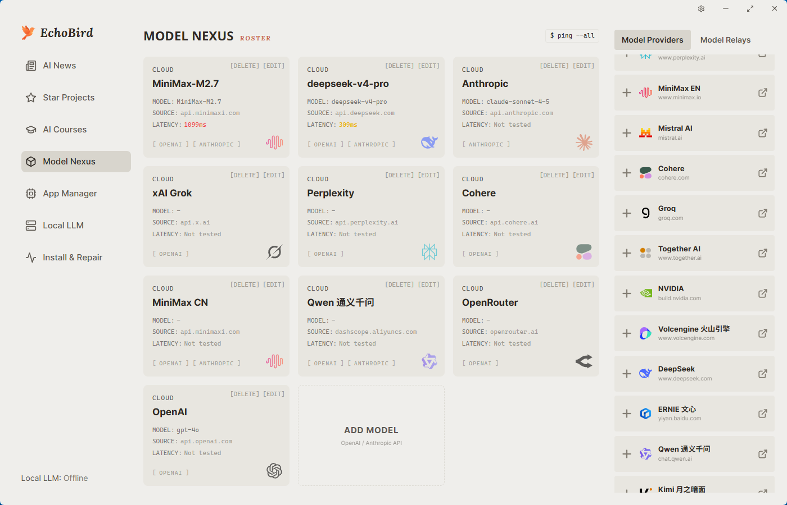
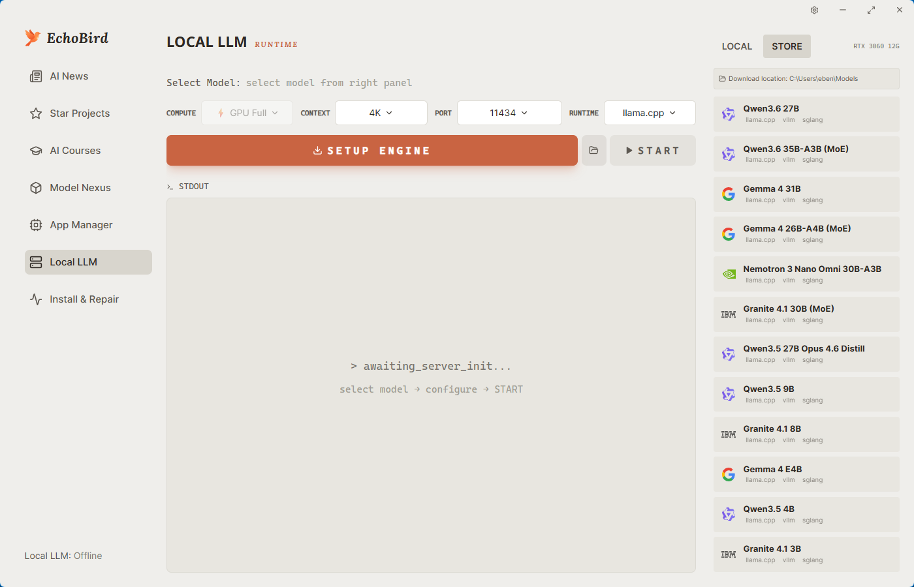
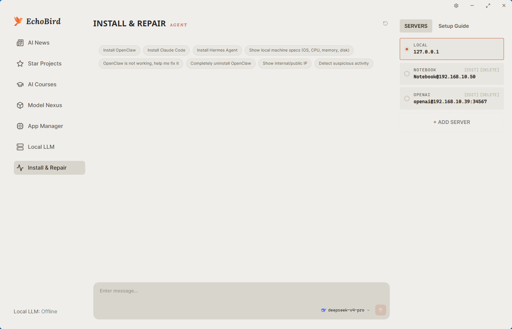

<p align="center">
  
</p>

<h1 align="center">EchoBird</h1>

<p align="center"><strong>AI deployment, no more chicken-and-egg.</strong></p>
<p align="center"><sub>AI 部署,不再是先有鸡还是先有蛋。</sub></p>

<p align="center">
  <a href="https://github.com/edison7009/EchoBird/releases">
    
  </a>
  
  
  
</p>

<p align="center">
  <a href="https://echobird.ai">Website</a> ·
  <a href="https://github.com/edison7009/EchoBird/releases/latest">Download</a> ·
  <a href="https://echobird.ai/support/">☕ Buy a coffee</a> ·
  <a href="README.zh-CN.md">中文 README</a>
</p>

> **Note** — This repository is just one of several download channels
> and an issue tracker. For product information, announcements, and
> commercial inquiries, visit [echobird.ai](https://echobird.ai).

---

## 💜 Sponsors

<table>
  <tr>
    <td width="150" align="center">
      <a href="https://go.apimart.ai/gh-echobird"></a>
    </td>
    <td>
      <a href="https://go.apimart.ai/gh-echobird"><strong>APIMart</strong></a><br/>
      Thanks to <strong>APIMart</strong> for sponsoring this project! APIMart is a low-cost API platform for AI image &amp; video generation — GPT-Image-2 from $0.006/image, 160+ images per dollar. One async API covers both image and video: submit a task, get an ID, fetch results via polling or callback. Batch tens of thousands of images without timeouts, switch models without changing code. Pay-as-you-go with no monthly fee — <a href="https://go.apimart.ai/gh-echobird">sign up here</a> to get started.
    </td>
  </tr>
  <tr>
    <td width="150" align="center">
      <a href="https://88api.ai/sign-up?aff=knFS"></a>
    </td>
    <td>
      <a href="https://88api.ai/sign-up?aff=knFS"><strong>88API</strong></a> — AI token aggregation platform<br/>
      Thanks to <strong>88API</strong> for sponsoring this project! 88API is a one-stop token aggregation platform: a single API key provides stable access to language &amp; coding models — GPT, Claude, Gemini, Grok, DeepSeek, Kimi, GLM and more — along with image models (GPT-Image, Gemini, Grok), video models (Seedance, Veo, MiniMax Hailuo H3, Kling) and speech (Whisper, TTS), covering everything from copywriting and image creation/editing to video generation and voice-overs. New users get free trial credits to test model capabilities, with human support on site. Operated with overseas corporate credentials — stable and dependable, official invoices, and a 1:1 top-up ratio.
    </td>
  </tr>
  <tr>
    <td width="150" align="center">
      <a href="https://grooroute.com/register?aff=FWGVPMYENJQ8"></a>
    </td>
    <td>
      <a href="https://grooroute.com/register?aff=FWGVPMYENJQ8"><strong>GrooRoute</strong></a> — Official Claude and GPT models<br/>
      Thanks to <strong>GrooRoute</strong> for sponsoring this project! Official Claude and GPT models are now available. We invite everyone with a curious mind to explore advanced AI, including Fable 5 and GPT-5.6. Connect directly from mainland China and get started with a single line of configuration — <a href="https://grooroute.com/register?aff=FWGVPMYENJQ8">sign up here</a>.
    </td>
  </tr>
</table>

Sponsorship contact: [hi@echobird.ai](mailto:hi@echobird.ai)

---

## What is EchoBird?

Friends kept asking me to install **Claude Code**, **OpenClaw**, **Hermes Agent**… every machine was different, and some refused to pay for an LLM. Setup and explanations took forever. So I built **EchoBird** — an Agent inspired by **Songbird**, the genius netrunner from _Cyberpunk 2077_ who solves any tech problem for V…

<p align="center">
  
  <br/>
  <sub><strong>DeepSeek Harness One-click install + model switch （DEMO）</strong></sub>
</p>

## Highlights

EchoBird offers **4 scenarios** sharing a **unified model data hub** — **configure once, used everywhere**.

### 4 scenarios

- **Install & Repair Agent** — let an AI install and fix mainstream tools (Claude Code, OpenClaw, Hermes Agent, …); works locally and remotely
- **One-click local LLM** — bundled vLLM / SGLang / llama.cpp runtimes; pick a quant, hit START
- **My AI Projects** — onboard and manage your own vibe-coded apps and games inside EchoBird
- **App Manager** — one-click launch and management for every AI / Agent app & game

### Shared foundation

- **Model Nexus** — a unified data hub for OpenAI / Anthropic / local LLMs / API Routers; configure once and all 4 scenarios pick it up; one-click latency check before you commit

**Cross-platform** — Windows, macOS, Linux (x64 + arm64)

## Supported tools — install & switch models in one click

EchoBird bundles the install references and **writes each tool's native config
file**, so you install from one place and — crucially — **switch the model
with a single click**. Configure a provider once in Model Nexus, then point
any supported tool at it; no manual TOML / JSON editing, no per-CLI re-login.
This is the part most "model switcher" repos leave you to figure out alone.

### One-click install + one-click model switch

The tools below support **both** — install _and_ model switching — which is
the core of what EchoBird is for:

**Coding CLIs** — Claude Code · Codex CLI (OpenAI) · Grok Build (xAI) ·
Kimi Code (Moonshot) · Qwen Code · Aider · OpenCode · MiMo Code (Xiaomi) · Kilo Code ·
ZCode (Z.AI) · OpenClaw · Pi · OpenScience · Vibe-Trading

**Desktop apps** — Claude Desktop (3P profile) · ChatGPT desktop ·
OpenCode Desktop · WorkBuddy (Tencent CodeBuddy)

> Searching GitHub for "switch model for Grok Build" or "switch model for
> Kimi Code"? Those are first-class here — pick the model in Model Nexus,
> hit switch, and EchoBird rewrites `~/.grok/config.toml` or
> `~/.kimi-code/config.toml` for you.

### One-click install & launch

These are detected, installed, and managed by EchoBird, but model switching
is handled by the app itself (vendor-locked or no model config):

Hermes Desktop · Claude Science · Trae / Trae CN · Cursor · VS Code ·
Gemini Desktop · Coffee CLI

## Screenshots

### AI News & Star Projects — your daily AI brief

> Day & night, side by side — the rest of the screenshots below follow your GitHub theme.

<table>
<tr>
  <td width="50%"></td>
  <td width="50%"></td>
</tr>
<tr>
  <td align="center"><sub>☀️ Light theme</sub></td>
  <td align="center"><sub>🌙 Dark theme</sub></td>
</tr>
</table>

### Model Nexus — the unified model data hub, configure once

<picture>
  <source media="(prefers-color-scheme: dark)" srcset="docs/screenshots/model-en-dark.png">
  
</picture>

### App Manager — one-click launch and management for every AI / Agent app

<picture>
  <source media="(prefers-color-scheme: dark)" srcset="docs/screenshots/app-en-dark.png">
  
</picture>

### Local LLM — run models on your own machine

<picture>
  <source media="(prefers-color-scheme: dark)" srcset="docs/screenshots/localllm-en-dark.png">
  
</picture>

### Install & Repair Agent — chat-driven setup and troubleshooting

<picture>
  <source media="(prefers-color-scheme: dark)" srcset="docs/screenshots/agent-en-dark.png">
  
</picture>

### My AI Career — dashboard

<p align="center">
  
</p>

## Install

### One-line install

**Windows** (PowerShell)

```powershell
irm https://echobird.ai/install.ps1 | iex
```

**macOS / Linux**

```sh
curl -fsSL https://echobird.ai/install.sh | sh
```

The script auto-detects your OS, downloads the right package, and skips if you're already on the latest version.

### Or download a package

Latest release → <https://github.com/edison7009/EchoBird/releases/latest>

| Platform                    | Asset                                  |
| --------------------------- | -------------------------------------- |
| Windows x64                 | `EchoBird_<ver>_Windows_x64-setup.exe` |
| macOS (Apple Silicon)       | `EchoBird_<ver>_macOS_arm64.dmg`       |
| Linux x64 · Debian/Ubuntu   | `EchoBird_<ver>_Linux_x64.deb`         |
| Linux arm64 · Debian/Ubuntu | `EchoBird_<ver>_Linux_arm64.deb`       |
| Linux x64 · Fedora/RHEL     | `EchoBird_<ver>_Linux_x64.rpm`         |
| Linux arm64 · Fedora/RHEL   | `EchoBird_<ver>_Linux_arm64.rpm`       |

## License & Trademarks

**Code** — EchoBird **v5.0.0 and later** are licensed under the
[MIT License](LICENSE). The full source is open — fork it, study it,
ship it. EchoBird
**v4.x and earlier** remain under AGPL-3.0-or-later in perpetuity
(already-released v4.x binaries are not retroactively relicensed).
See [NOTICE](NOTICE) for attribution.

**Trade dress + brand** — EchoBird's primary protection is its **UI / UX trade
dress**: the specific combination of four user-facing surfaces sharing one
central model hub, plus the bundling of two complete reference applications
(Reversi + AI Translator) as user tutorial templates. The wordmark **EchoBird**
is a common-law trademark of edison7009; feature labels like _Model Nexus_ /
_模型中心_ are descriptive and protected only as part of the trade dress.
**Forks are welcome — no need to scrub our name and logo.** If your fork
honestly credits EchoBird as upstream, you may keep our identity visible
(e.g. "EchoBird Community Edition by X"). If you prefer to rebrand entirely,
that's also fine — just keep the NOTICE attribution. The hard lines are:
**commercial SaaS / app-store products literally branded "EchoBird"**
without permission; **presenting the code as your own from-scratch original
work**; and **adopting three or more of our four UI surfaces side-by-side in
a competing product without independent prior-work documentation** (see
[NOTICE](NOTICE) for the formal threshold). See [TRADEMARKS.md](TRADEMARKS.md)
for the full policy.

---

<p align="center">
  Made with 💚 by EchoBird Team<br>
  <sub>⭐ <a href="https://github.com/edison7009/EchoBird">Star on GitHub</a> · <a href="README.zh-CN.md">中文文档</a></sub>
</p>
