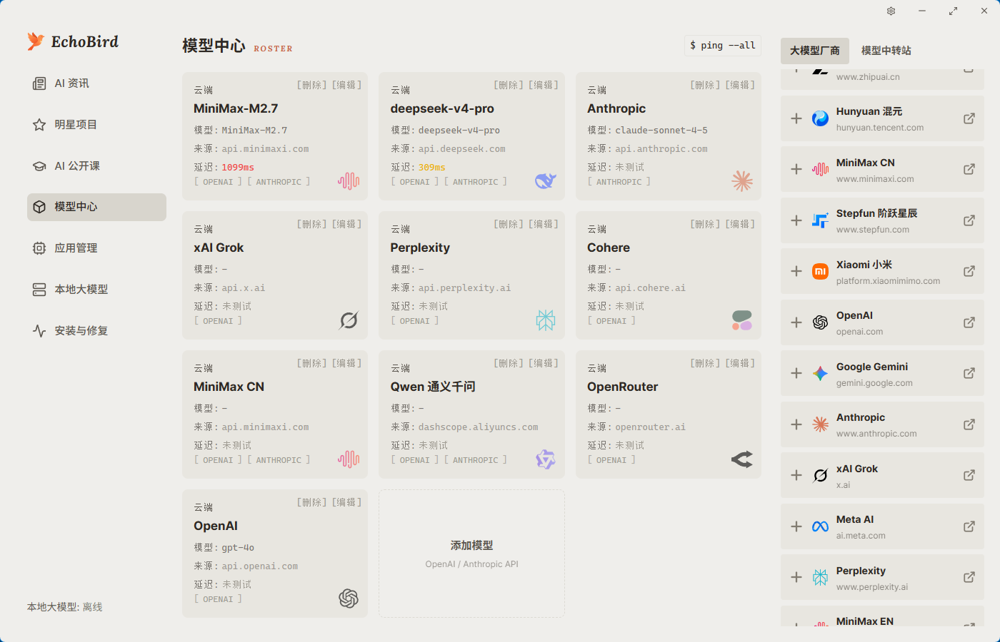
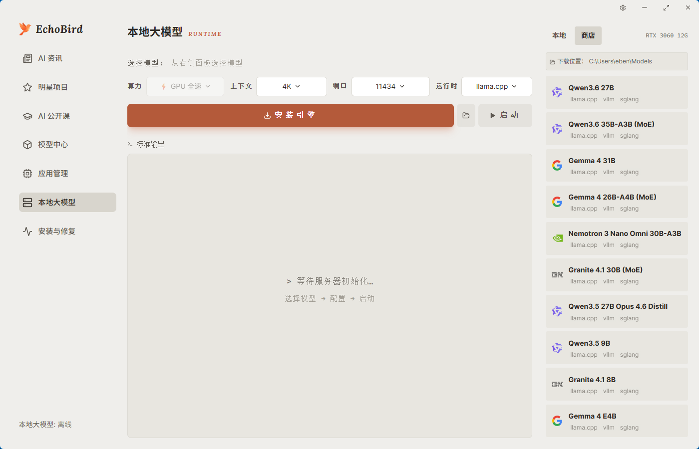
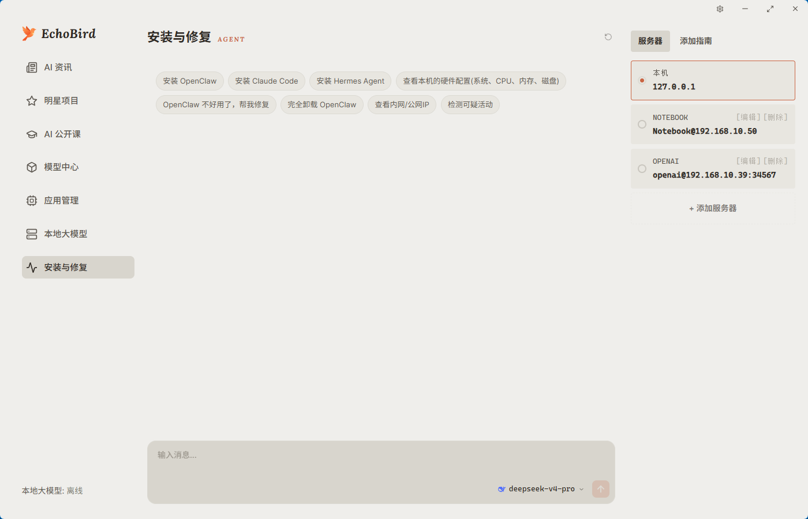

<p align="center">
  
</p>

<h1 align="center">EchoBird</h1>

<p align="center"><strong>AI 部署,不再是先有鸡还是先有蛋。</strong></p>

<p align="center">
  <a href="https://github.com/edison7009/EchoBird/releases">
    
  </a>
  
  
  
</p>

<p align="center">
  <a href="https://echobird.ai">官网</a> ·
  <a href="https://github.com/edison7009/EchoBird/releases/latest">下载</a> ·
  <a href="https://echobird.ai/support/">☕ 请喝咖啡</a> ·
  <a href="README.md">English README</a>
</p>

> **说明** —— 本仓库仅为下载渠道与 issue 反馈渠道之一,产品信息、
> 公告、商业询价请访问 [echobird.ai](https://echobird.ai)。

---

## 💜 赞助商

<table>
  <tr>
    <td width="150" align="center">
      <a href="https://go.apimart.ai/gh-echobird"></a>
    </td>
    <td>
      <a href="https://go.apimart.ai/gh-echobird"><strong>APIMart</strong></a><br/>
      感谢 <strong>APIMart</strong> 赞助了本项目!APIMart 是专注 AI 图片/视频生成的低价 API 平台,GPT-Image-2 低至 $0.006/张,1 美元可出图 160+ 张。图片、视频一套异步 API 通吃,提交任务拿 ID、回调取结果,跑批万张不超时、换模型不改代码。按量付费、无月费,通过<a href="https://go.apimart.ai/gh-echobird">此链接</a>注册即可开用。
    </td>
  </tr>
  <tr>
    <td width="150" align="center">
      <a href="https://88api.ai/sign-up?aff=knFS"></a>
    </td>
    <td>
      <a href="https://88api.ai/sign-up?aff=knFS"><strong>88API Token聚合平台</strong></a><br/>
      感谢 <strong>88API</strong> 赞助了本项目!88API 是一站式 Token 聚合平台:一个 API Key 即可稳定接入 GPT、Claude、Gemini、Grok、DeepSeek、Kimi、GLM 等语言与编程模型,以及 GPT-Image、Gemini、Grok 等图片模型,Seedance、Veo、MiniMax Hailuo H3、Kling 等视频模型和 Whisper、TTS 等语音能力,从文案、出图、改图到视频生成与配音全覆盖。新用户注册送体验额度,可先检测模型能力;站内有人工客服值守。海外企业资质运营、稳定不跑路,支持正规发票,充值比例 1:1。
    </td>
  </tr>
  <tr>
    <td width="150" align="center">
      <a href="https://grooroute.com/register?aff=FWGVPMYENJQ8"></a>
    </td>
    <td>
      <a href="https://grooroute.com/register?aff=FWGVPMYENJQ8"><strong>GrooRoute</strong></a> — Claude 与 GPT 官方原模型<br/>
      感谢 <strong>GrooRoute</strong> 赞助了本项目!现已开放 Claude 与 GPT 官方原模型。我们邀请每一个有好奇心的人，用上最先进的智能。国内直连，即开即用——一行配置，接入 Fable 5、GPT-5.6 在内的前沿模型。通过<a href="https://grooroute.com/register?aff=FWGVPMYENJQ8">此链接</a>注册即可开用。
    </td>
  </tr>
</table>

赞助联系：[hi@echobird.ai](mailto:hi@echobird.ai)

---

## 这是什么

很多朋友让我帮他们安装 **Claude Code**、**OpenClaw**、**Hermes Agent**……不但每个人的系统都不一样,甚至有些人还抠门到不愿花钱买大模型,安装和解释起来都特别费劲。于是我开发了这个叫「EchoBird」的 Agent —— 灵感来自《赛博朋克 2077》里那位聪慧过人、总能帮主角搞定一切技术难题的天才女助理 **Songbird**…

<p align="center">
  
  <br/>
  <sub><strong>DeepSeek Harness 一键安装+切换模型 （演示）</strong></sub>
</p>

## 亮点

EchoBird 提供 **4 大场景**,共享一个 **模型数据中枢** —— **一处配置,四处生效**。

### 4 大场景

- **安装与修复** —— 让 AI 帮你安装与修复主流 AI 工具(Claude Code、OpenClaw、Hermes Agent 等);本地与远程都支持
- **一键本地大模型** —— 内置 vLLM / SGLang / llama.cpp 三引擎,选好量化版本按下 START 就能跑
- **我的 AI 项目** —— 你自己 Vibe Coding 的应用或游戏,在 EchoBird 里统一接入与管理
- **应用管理** —— 所有跟 AI / Agent 有关的应用或游戏一键启动与管理

### 共享地基

- **模型中心** —— 统一的模型数据中枢(OpenAI / Anthropic / 本地 LLM / API Router);一处配置好,4 大场景立即生效;附带一键测速,使用前看清真实延迟

**跨平台** —— Windows、macOS、Linux(x64 + arm64)

## 支持的工具 —— 一键安装、一键切换模型

EchoBird 内置了各工具的安装脚本,**并直接写入每个工具的原生配置文件**,
所以你既能在一个地方装好,更关键的是能**一键切换模型**。在模型中心配好一处
provider,任意支持的工具都能指向它;不用手改 TOML / JSON,不用每个 CLI 重新
登录。这正是大部分「切换模型」开源仓要你自己折腾的部分。

### 一键安装 + 一键切换模型

以下工具**同时**支持安装与切换模型 —— 这是 EchoBird 的核心:

**编程 CLI** —— Claude Code · Codex CLI(OpenAI) · Grok Build(xAI) ·
Kimi Code(月之暗面) · Qwen Code · Aider · OpenCode · MiMo Code(小米) · Kilo Code ·
ZCode(Z.AI) · OpenClaw · Pi · OpenScience · Vibe-Trading

**桌面应用** —— Claude Desktop(第三方 profile) · ChatGPT 桌面版 ·
OpenCode Desktop · WorkBuddy(腾讯 CodeBuddy 办公版)

> 在 GitHub 上搜「给 Grok Build 切换模型」「给 Kimi Code 切换模型」?
> 这两个在这里都是一等公民 —— 在模型中心选好模型,按下切换,EchoBird
> 就帮你重写 `~/.grok/config.toml` 或 `~/.kimi-code/config.toml`。

### 一键安装与启动

这些工具由 EchoBird 检测、安装、管理,但模型切换由应用自身负责
(厂商锁定或无模型配置):

Hermes Desktop · Claude Science · Trae / Trae CN · Cursor · VS Code ·
Gemini Desktop · Coffee CLI

## 界面截图

### 模型中心 —— 模型数据中枢,一处配置,四处生效

<picture>
  <source media="(prefers-color-scheme: dark)" srcset="docs/screenshots/model-cn-dark.png">
  
</picture>

### 应用管理 —— 所有 AI / Agent 应用一键启动与管理

<picture>
  <source media="(prefers-color-scheme: dark)" srcset="docs/screenshots/app-cn-dark.png">
  
</picture>

### 本地大模型 —— 在自己机器上跑

<picture>
  <source media="(prefers-color-scheme: dark)" srcset="docs/screenshots/localllm-cn-dark.png">
  
</picture>

### 安装与修复 —— 用对话搞定部署和排障

<picture>
  <source media="(prefers-color-scheme: dark)" srcset="docs/screenshots/agent-cn-dark.png">
  
</picture>

### 我的 AI 生涯 —— 仪表盘

<p align="center">
  
</p>

## 安装

### 一行命令安装

**Windows**(PowerShell)

```powershell
irm https://echobird.ai/install.ps1 | iex
```

**macOS / Linux**

```sh
curl -fsSL https://echobird.ai/install.sh | sh
```

脚本会自动识别你的系统,下载对应的安装包,如果你已经是最新版会自动跳过。

### 或者下载安装包

最新版本 → <https://github.com/edison7009/EchoBird/releases/latest>

| 平台                        | 安装包                                 |
| --------------------------- | -------------------------------------- |
| Windows x64                 | `EchoBird_<ver>_Windows_x64-setup.exe` |
| macOS(Apple Silicon)        | `EchoBird_<ver>_macOS_arm64.dmg`       |
| Linux x64 · Debian/Ubuntu   | `EchoBird_<ver>_Linux_x64.deb`         |
| Linux arm64 · Debian/Ubuntu | `EchoBird_<ver>_Linux_arm64.deb`       |
| Linux x64 · Fedora/RHEL     | `EchoBird_<ver>_Linux_x64.rpm`         |
| Linux arm64 · Fedora/RHEL   | `EchoBird_<ver>_Linux_arm64.rpm`       |

## 协议与商标

**代码** —— EchoBird **v5.0.0 及以后版本**采用
[MIT](LICENSE) 协议。完整源码全部开放:随便 fork、研读、二次发布。
EchoBird **v4.x 及以前版本**永久保留在
AGPL-3.0-or-later 协议下(已发布的 v4.x 二进制不溯及改约)。署名要求见
[NOTICE](NOTICE)。

**商业外观 + 品牌** —— EchoBird 的主防线是 **UI / UX 商业外观(trade dress)**:
四个用户面向界面共享同一个中央模型枢纽的具体组合,以及内置两个完整可运行的
参考应用(黑白棋 + AI 翻译)作为用户教程模板。**EchoBird** 是 edison7009 的
单一普通法文字商标;_Model Nexus / 模型中心_ 等功能名是描述性标签,**不单独
主张为商标**,只作为 trade dress 的一部分受保护。**Fork 欢迎 —— 无需抹掉我们
的名字和 Logo**。如果你的 fork 在 README / About 页面 / 产品页诚实标注 EchoBird
为上游,可以保留我们的身份可见(例:"EchoBird 社区版 by X");完全重新品牌化
也可以,改名 + 替换 Logo,但 NOTICE 中保留致谢。硬底线有三条:**未授权的商业
SaaS / 应用商店产品字面挂 EchoBird**;**把代码当作你从零写的原创发布**;以及
**在没有独立先创证据的情况下,在一个竞争性产品中并列采用我们四个 UI 界面中的
三个或以上**(详见 [NOTICE](NOTICE) 阈值)。完整政策见 [TRADEMARKS.md](TRADEMARKS.md)。

---

<p align="center">
  Made with 💚 by EchoBird Team<br>
  <sub>⭐ <a href="https://github.com/edison7009/EchoBird">在 GitHub 上点个 Star</a> · <a href="README.md">English README</a></sub>
</p>
